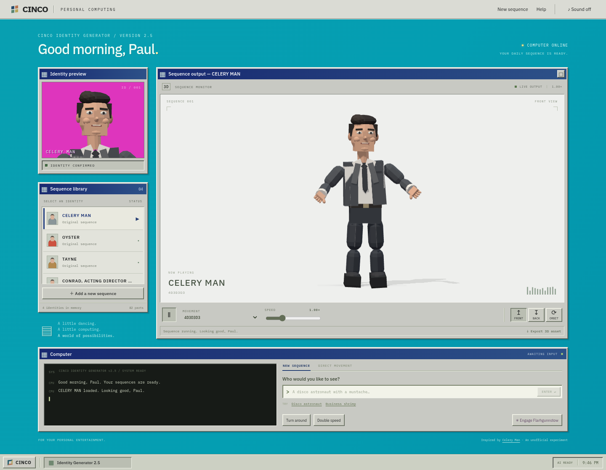
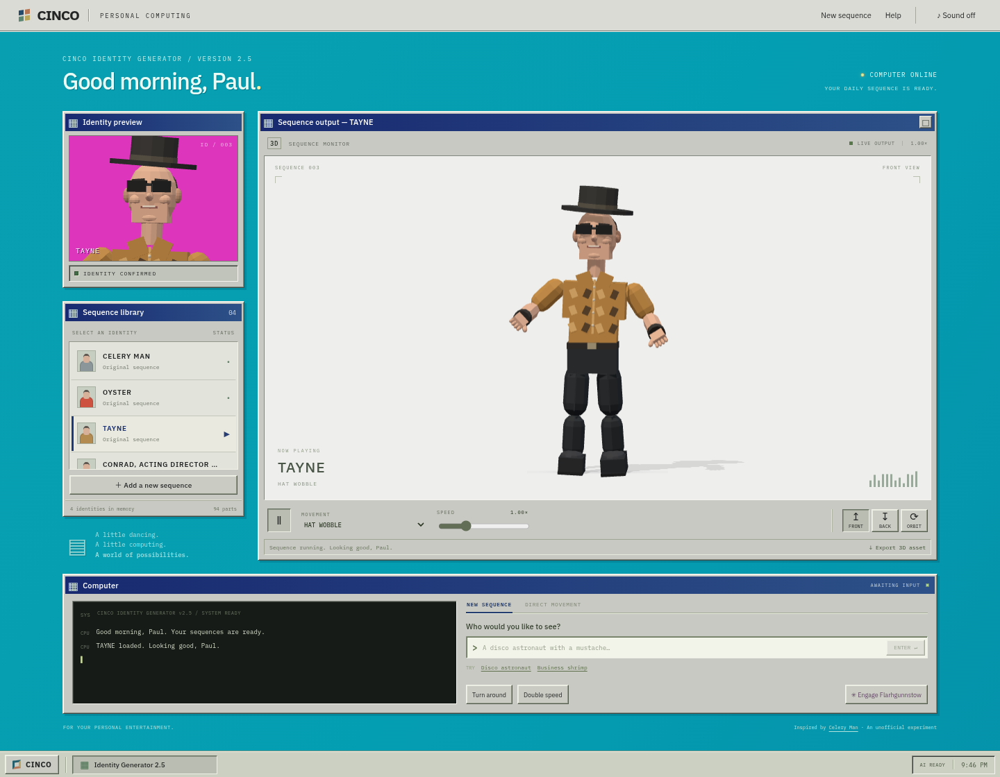
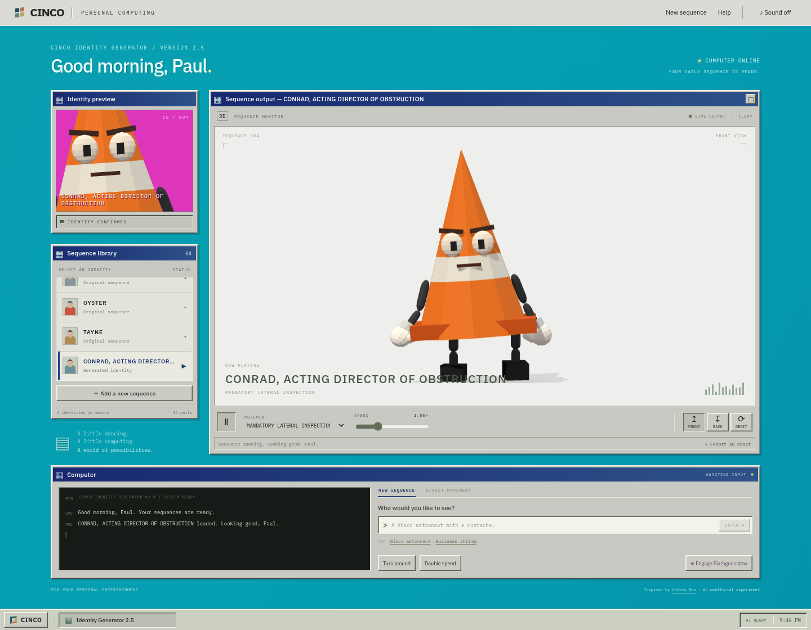

# Paul's Computer

## Watch the original: Celery Man

It all starts with Tim & Eric's **Celery Man**, also known as **Paul Rudd's Computer**. Watch the sketch that inspired this project:

[](https://www.youtube.com/watch?v=maAFcEU6atk)

**[▶ Watch Celery Man on YouTube](https://www.youtube.com/watch?v=maAFcEU6atk)**

## The web version

An interactive homage to **Celery Man / Paul Rudd's Computer**: a cyan desktop, beveled windows, a politely absurd computer, and actual animated 3D characters. Type an identity, wait for the computer to build it, then direct its movements.

## Screenshots

### Paul / Celery Man

Your daily sequence is ready.



### Tayne

A little hat wobble for the working professional.



### Conrad, Acting Director of Obstruction

An actual AI-generated traffic-cone office manager. His default dance is **Mandatory Lateral Inspection**.



## Run on NixOS

```sh
cd paul-rudds-computer
nix develop path:.
npm ci
npm run example:conrad
npm run dev
```

Open **http://localhost:5173**. The server binds to loopback by default. The included `flake.lock` pins the development tools. With direnv, `.envrc` offers the same shell.

The default provider uses the installed **Codex CLI** and your existing login. No API key is needed for that local workflow. Install a current CLI and run `codex login` first; the local integration was verified with Codex CLI 0.153.3. The app isolates worker directories, ignores project/user instructions, and disables tools, plugins, and MCP. `CODEX_MODEL` can select a model explicitly; otherwise it uses the CLI's built-in default. Generation typically takes one or two minutes and has a four-minute timeout.

Node 22.12+ also works without Nix: `npm ci && npm run example:conrad && npm run dev`. The built-in sequences and Conrad work without AI credentials; creating new identities and motions requires a configured provider.

## Using the computer

- Choose **Celery Man**, **Oyster**, or **Tayne**. Each has an articulated original model and several looping animations.
- **New sequence**: try “a business shrimp in a tiny suit” or “a disco astronaut with a magnificent mustache.” The AI designs geometry, colors, joints, and initial choreography.
- **Direct movement**: tell the current character to bow, wave, dance, jump, or attempt a hat wobble. A new animation is added to that same character and selected automatically.
- Use **Turn around**, camera orbit, speed, pause, and **Flarhgunnstow** for immediate manipulation. The latter brings in synchronized duplicates. Tayne includes a built-in hat wobble.
- **Sound on** enables an original synthesized computer groove and the browser's speech synthesis, if available. Voice availability depends on the browser and operating system.
- **Export 3D asset** downloads a binary glTF (`.glb`) containing the character hierarchy and all its animation clips. It opens in Blender without a conversion step.
- **Space** pauses/resumes; **/** focuses the command input; **Escape** closes Help or restores a maximized output window.

Generation runs in the background while the current sequence continues. Cancel stops the worker. Completed identities and added motions are saved atomically under `.data/sequences/` and survive restarts. The archive supports 200 identities and 24 motions per identity. Research media, local data, credentials, and build artifacts are excluded from Git.

**Conrad, Acting Director of Obstruction**, is included in [examples/conrad.json](examples/conrad.json), with both his original dance and a second AI-generated turn-and-wave clip. `npm run example:conrad` imports him into your local archive without replacing an existing Conrad or changing his choreography. Start or restart the server after importing.

## What is being generated?

These are **real procedural low-poly 3D assets**, not pre-rendered video or flat character pictures. The model returns a bounded JSON scene graph of primitives, joint pivots, and animation keyframes. Three.js constructs the meshes and plays the articulated animation. This is deliberately a stylized early-CGI interpretation of the skit's live-action cutouts; it does not produce photorealistic likenesses or arbitrary sculpted/textured meshes.

The schema supports nonhuman characters and custom joint structures. Motion requests generate new keyframes for existing parts, so they can invent choreography but cannot add a prop or a new body part. Create a new identity with the prop in its description when needed. There is no physical simulation or learned motion model; geometry and choreography quality vary with the model's spatial reasoning.

Blender is not required at runtime. It was used to verify an actual exported asset imports correctly. A future mesh-generation service or Blender worker can be added behind a separate asset-builder interface while preserving the computer interaction.

## Providers and future BYOK

Copy `.env.example` to `.env` if you need configuration. Environment variables take precedence. All provider calls and credentials stay on the server.

```dotenv
AI_PROVIDER=codex
# CODEX_BIN=codex
# CODEX_MODEL=your-model
```

An alternative provider is implemented for **OpenAI-compatible Chat Completions endpoints with strict JSON Schema output support**:

```dotenv
AI_PROVIDER=openai
AI_API_KEY=your-key
AI_MODEL=your-model
AI_BASE_URL=https://api.openai.com/v1
```

`server/providers.ts` defines `Provider` with `status`, `generate`, and `motion`. Both providers return the same validated scene/clip data. The frontend and renderer do not depend on Codex. The API provider's request and error handling are covered with a local mock upstream; real BYOK credentials have not yet been tested.

This is a working **single-user local application**. Public deployment still needs authentication, per-user credential handling/storage, quotas, and durable job handling. `APP_ORIGIN` is origin allowlisting, not authentication. HTTPS reverse-proxy support also needs explicit trusted-proxy/protocol configuration. The local Codex worker should stay on a trusted machine. The present API adapter uses a server-level environment key; a per-user BYOK screen and credential lifecycle are intentionally future work.

## Architecture

```text
React desktop → Express job API → Provider (Codex CLI / compatible API)
                                      ↓
                              validated JSON scene / motion
                                      ↓
                         atomic local archive → Three.js → GLB
```

- `shared/scene.ts`: bounded scene/animation schema; validates parent references, cycles, renderability, transforms, and animation targets.
- `shared/presets.ts`: three original, source-inspired character rigs and choreography.
- `src/scene.ts`: native Three.js geometry, animation playback, portrait/body cameras, and GLB export.
- `server/providers.ts`: structured generation; generated output is data and is never executed as code.
- `server/jobs.ts`: bounded job queue, cancellation, timeout, and status.
- `server/store.ts`: validated, atomic sequence persistence.
- `src/App.tsx`: desktop interaction and asynchronous job lifecycle.

API: `GET /api/health`, `GET /api/sequences`, `POST /api/generate {prompt}`, `POST /api/sequences/:id/motion {prompt}`, `GET /api/jobs/:id`, `DELETE /api/jobs/:id`. POST returns an asynchronous job; poll until `complete` or `error`. Completed jobs include `result`, a sequence with `id`, `character`, `createdAt`, and `source`.

## Checks and production build

```sh
nix develop path:. -c npm test
nix develop path:. -c npm run build
nix develop path:.#browser -c npm run test:e2e

# After building:
nix develop path:. -c npm start
```

The browser shell provides a Nix-native Chromium executable, avoiding downloaded Linux binaries that do not run directly on NixOS. Playwright checks actual WebGL rendering, library controls, camera/speed/playback, GLB downloads, mobile overflow, generation/motion state transitions, delayed submission, cancellation races, and error recovery. Browser generation tests use intercepted job responses, while actual Codex character and motion generation were verified separately.

## Updating the screenshots

```sh
nix develop path:.#browser -c npm run screenshots
```

This captures Paul / Celery Man, Tayne, and Conrad into `docs/screenshots/`, where GitHub can render them directly in this README. It starts a temporary server with a separate example archive, leaves your current library untouched, and stops that server afterward. On other platforms, install Playwright Chromium (`npx playwright install chromium`) and run `npm run screenshots`.

## Reference study

The [original source video](https://www.youtube.com/watch?v=maAFcEU6atk) was downloaded successfully with audio and English automatic captions. We extracted 108 stills and inspected the interface, costumes, timing, and signature actions. [Reference notes](reference/notes.md) include timestamped findings. The downloaded media and contact sheet live in the local `reference/` folder and are excluded from this repository. The acquisition script and notes are included.

To reproduce the reference download and extraction:

```sh
bash reference/fetch-reference.sh
```

The script uses Nix, yt-dlp, Deno/EJS, and FFmpeg. Default YouTube clients initially returned HTTP 403; the documented `tv,web_embedded` client combination worked. Automatic captions contain name-recognition errors, described in the notes.

Implementation references: [Codex non-interactive mode](https://learn.chatgpt.com/docs/non-interactive-mode), [Codex configuration](https://learn.chatgpt.com/docs/config-file/config-reference), [structured outputs](https://developers.openai.com/api/docs/guides/structured-outputs).

This is an unofficial fan experiment inspired by Tim & Eric. The runtime includes no footage, sampled dialogue, or music from the source video.

## License

[MIT](LICENSE). The license covers this project's code and original assets. Tim & Eric, Celery Man, and the source video belong to their respective owners; this is an unofficial homage with no affiliation or endorsement.
